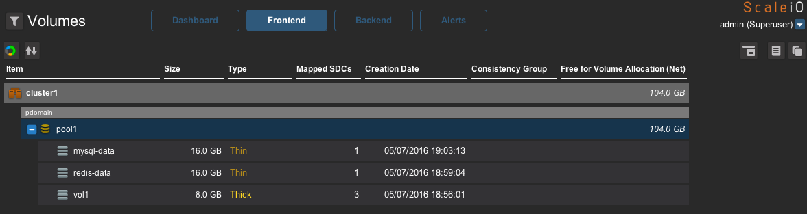

vagrant-scaleio
---------------

# Description

Automatically deploy ScaleIO in an isolated environment on top of VirtualBox to test containers with persistent applications.

Environment Details:

- Three CentOS 7.3 nodes
- Each node gets installed with the latest the ScaleIO software
- Configuration happens automatically to have a fully redundant ScaleIO cluster.

Optional Software Installations for Containers (read usage instructions below):

- [Docker](https://docker.com)
- [REX-Ray](https://github.com/codedellemc/rexray)
- [Docker Swarm](https://docs.docker.com/engine/swarm/)
- [Apache Mesos](http://mesos.apache.org/) and [Marathon by Mesosphere](https://github.com/mesosphere/marathon)
- [Kubernetes](https://kubernetes.io/)

## Requirements:

VirtualBox and Vagrant

For optional proxy setup, make sure you have the `vagrant-proxyconf` plugin installed.

## Usage

Set the following Environment Variables to `true` or `false` for your needs (must use `export`)

 - `SCALEIO_CLUSTER_INSTALL` - Default is `true`. If `true` a fully working ScaleIO cluster is installed. False only installs IM on node MDM1.
 - `SCALEIO_DOCKER_INSTALL` - Default is `true`.
 - `SCALEIO_REXRAY_INSTALL` - Default is `true`.
 - `SCALEIO_SWARM_INSTALL` - Default is `false`. Set to `true` to automatically configure Docker Swarm.
 - `SCALEIO_MESOS_INSTALL` - Default is `false`. Set to `true` to automatically install Apache Mesos and Marathon.
 - `SCALEIO_K8S_INSTALL` - Default is `false`. Set to `true` to automatically install Kubernetes.
 - `SCALEIO_RAM` - Default is `1024`. Depending on the docker images being used, RAM needs to be increased to 1.5GB or 2GB for node01 and node02. Master will always use 3GB
 - `SCALEIO_VERIFY_FILES` - Default is `true`. This will verify the ScaleIO package is available for download.

1. `git clone https://github.com/codedellemc/vagrant.git`
2. `cd vagrant/scaleio`
3. Edit the proxies (if needed)
4. `vagrant up` (if you have more than one Vagrant Provider on your machine run `vagrant up --provider virtualbox` instead)

Note, the cluster will come up with the default unlimited license for dev and test use.

### SSH

To login to the ScaleIO nodes, use the following commands: `vagrant ssh master`, `vagrant ssh node01`, or `vagrant ssh node02`.

### Cluster install function

In the Vagrantfile, there is a variable named `clusterinstall` that controls how Vagrant provisions ScaleIO during `vagrant up` process.

By default this is set to `true` and can be overridden using `export SCALEIO_CLUSTER_INSTALL=false`.

If `true`, a fully functional ScaleIO cluster is installed with IM, MDM, TB, SDC and SDS on three nodes.

If set to `False`, three base VMs are installed with IM running on the machine named MDM1. To install your cluster when using `clusterinstall=False` you do `vagrant up` as usual but once complete use your web browser and point it to https://192.168.50.12. Login with `admin` and `Scaleio123`. From here you can deploy a new ScaleIO cluster using IM, great for demo and learning purposes.

### Example CSV file for deployment of ScaleIO cluster using IM:

```
IPs,Password,Operating System,Is MDM/TB,Is SDS,SDS Device List,Is SDC
192.168.50.12,vagrant,linux,Master,Yes,/home/vagrant/scaleio1,Yes
192.168.50.13,vagrant,linux,Slave,Yes,/home/vagrant/scaleio1,Yes
192.168.50.11,vagrant,linux,TB,Yes,/home/vagrant/scaleio1,Yes
```

### Docker and REX-Ray

Docker and REX-Ray will automatically be installed on all three nodes but can be overridden using the Environment Variables above. Each will configure REX-Ray to manage ScaleIO volumes for persistent applications in containers.

To run a container with persistent data stored on ScaleIO, from any of the cluster nodes you can run the following examples:

Run Busybox with a volume mounted at `/data`:
```
docker run -it --volume-driver=rexray -v data:/data busybox
```

Run Redis with a volume mounted at `/data`:
```
docker run -d --volume-driver=rexray -v redis-data:/data redis
```

Run MySQL with a volume mounted at `/var/lib/mysql`:
````
docker run -d --volume-driver=rexray -v mysql-data:/var/lib/mysql -e MYSQL_ROOT_PASSWORD=my-secret-pw mysql
````

Visit the [{code} Labs](https://github.com/codedellemc/labs) for more examples using Postgres and Minecraft.

##### Docker High Availability

Since the nodes all have access to the ScaleIO environment, fail over services with REX-Ray are available by stopping a container with a persistent volume on one host, and start it on another. Docker's integration with REX-Ray will automatically map the same volume to the new container, and your application can continue working as intended.

### Docker Swarm, Apache Mesos, and Kubernetes

In each configuration, `master` machine takes care of management roles because this is the ScaleIO Gateway for API communication. `node01` and `node02` are configured as Worker nodes with no management functionality.

##### Docker Swarm

Automatically build a Swarm cluster with `export SCALEIO_SWARM_INSTALL=true` as an environment variable.

The `docker service` command is used to create a service that is scheduled on nodes and can be rescheduled on a node failure. As a quick demonstration go to `master` and run a postgres service and pin it to the worker nodes:

```
$ docker service create --replicas 1 --name pg -e POSTGRES_PASSWORD=mysecretpassword \
--mount type=volume,target=/var/lib/postgresql/data,source=postgres,volume-driver=rexray \
--constraint 'node.role == worker' postgres
```

Use `docker service ps pg` to see which node it was scheduled on. Go to that node and stop the docker service with `sudo systemctl stop docker`. On master, a `docker service ps pg` will show the container being rescheduled on a different worker.

If it doesn't work, restart the service on the node, go to the other and download the image using `docker pull postgres` and start again.

##### Apache Mesos with Marathon

Automatically build a Mesos with Marathon cluster using `export SCALEIO_MESOS_INSTALL=true` as an environment variable.

For [Apache Mesos](http://mesos.apache.org/) and [Marathon by Mesosphere](https://github.com/mesosphere/marathon)  instructions for deploying containers, visit the [{code} Labs](https://github.com/codedellemc/labs) and try [Storage Persistence with Postgres using Mesos, Marathon, Docker, and REX-Ray](Storage Persistence with Postgres using Mesos, Marathon, Docker, and REX-Ray). Mesos and Marathon Web GUIs will be accessible from `http://192.168.50.11:5050` and `http://192.168.50.11:8080`.

```
$ curl -O https://raw.githubusercontent.com/codedellemc/labs/master/demo-persistence-with-postgres-marathon-docker/postgres.json
$ curl -k -XPOST -d @postgres.json -H "Content-Type: application/json" http://192.168.50.12:8080/v2/apps
```

##### Kubernetes

Automatically build a Kubernetes cluster using `export SCALEIO_K8S_INSTALL=true` as an environment variable.

ScaleIO has a native [Kubernetes](https://kubernetes.io/) integration. This means it doesn't rely on a tool like REX-Ray to function. Using standard Kubernetes Pods, Deployments/ReplicaSet, Dynamic Provision, etc is all built-in. On `master` node there is a folder called `k8s-examples` that can be used to create the namespace, secret, a standard pod, and deployment, storage class, and more.

REX-Ray is installed on all nodes for ease of volume management. If storage classes and dynamic provisioning is not used, Kubernetes expects the volumes to be available. REX-Ray is an easy tool to quickly create the volumes like `sudo rexray create pgdata-k8s-01 --size=16` that is needed by `deployment.yaml`.

As an example:
```
vagrant ssh master
cd k8s_examples
kubectl create -f namespace.yaml
kubectl create -f secret.yaml
kubectl create -f storageclass.yaml
kubectl create -f dynamicdeployment.yaml
kubectl create -f pgstatefulset.yaml
```


### ScaleIO GUI

The ScaleIO GUI is automatically extracted and put into the `vagrant/scaleio/gui` directory, just run `run.sh` and it should start up. Connect to your instance with the credentials outlined in the [Cluster install function](# Cluster install function).

The end result will look something like this:



# Troubleshooting

If anything goes wrong during the deployment, run `vagrant destroy -f` to remove all the VMs and then `vagrant up` again to restart the deployment.

# Contribution Rules

Create a fork of the project into your own repository. Make all your necessary changes and create a pull request with a description on what was added or removed and details explaining the changes in lines of code. If approved, project owners will merge it.

# Support

Please file bugs and issues on the [GitHub issues page](https://github.com/codedellemc/vagrant/issues). This is to help keep track and document everything related to this repo. For general discussions and further support you can join the [{code} by Dell EMC Community Slack](http://community.codedellemc.com/). The code and documentation are released with no warranties or SLAs and are intended to be supported through a community driven process.
